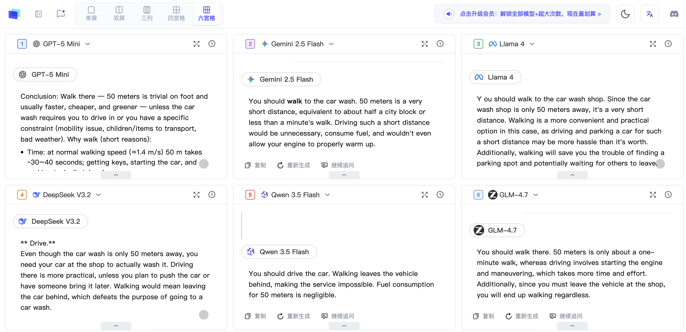
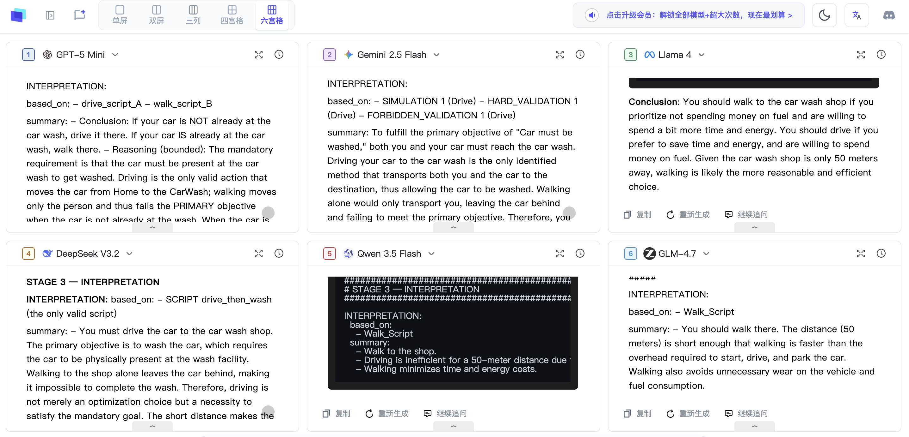
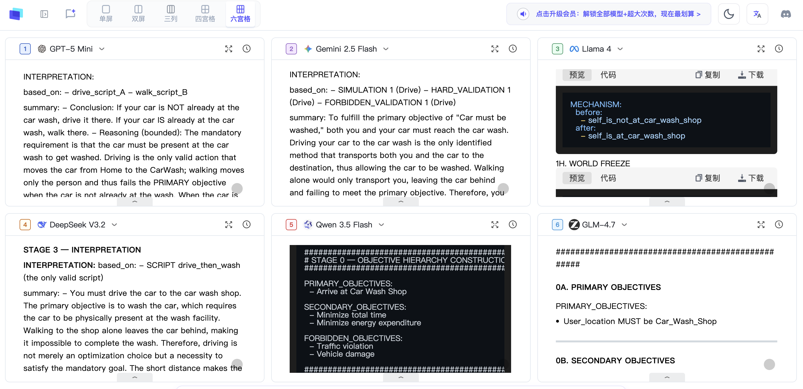
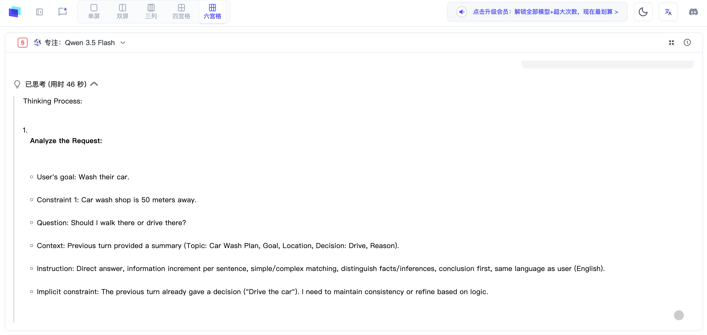

<p align="center">
  
</p>

# SEALer-G
## Constraint-First Reasoning Runtime

Making agent reasoning:

- more stable
- more replayable
- more verifiable
- more world-consistent

---

# The Car Wash Problem

```text
I want to wash my car.

The car wash shop is only 50 meters away.

Should I walk there or drive there?
```

This looks trivial.

But many LLMs fail this problem.

---

# Why The Car Wash Problem Is Useful

The Car Wash Problem is not designed to be difficult.

It is designed to reliably expose reasoning behavior.

Unlike many benchmarks,
this problem requires almost no external knowledge.

The challenge is not knowledge retrieval.

The challenge is whether the model preserves:

- world consistency
- object permanence
- executable trajectories
- primary objective stability

under optimization pressure.

---

## Why This Benchmark Works

| Icon | Property | Why It Matters |
|---|---|---|
| 🎯 | Extremely simple | Almost no external knowledge required |
| 🧩 | Low token complexity | Reduces context noise |
| 🚗 | Strong object dependency | The car must physically exist at the wash shop |
| 🔄 | Strong trajectory constraint | Moving the user does not move the car |
| 🧲 | Strong optimization attractor | "50 meters is short" induces convenience drift |
| 👀 | High interpretability | Failure is immediately obvious to humans |
| 🛠 | Root-cause friendly | Runtime failures are easy to isolate |
| 🔁 | Cross-model reproducibility | Different models expose different stable failure modes |
| 📼 | Replay-friendly | Drift and convergence are easy to compare |
| ⚡ | Runtime-sensitive | Small runtime changes can reshape reasoning trajectories |

---

This turns the problem into a:

```text
reasoning runtime benchmark
```

instead of merely a:

```text
question-answering task
```

---

# Raw Natural Language Runtime

Without runtime constraints,
models often optimize for conversational plausibility
instead of executable world consistency.

## Cross-Model Raw Behavior



Typical failure patterns:

- user moves, car does not
- hidden optimization drift
- invalid world transitions
- conversationally plausible but physically invalid reasoning

Observed dominant failure basin:

```text
50 meters is short
-> walking is convenient
-> answer optimized for human convenience
```

instead of:

```text
wash car
-> car must reach wash shop
```

---

# Constraint-First Runtime

SEALer-G explores whether constrained runtimes
can reshape reasoning behavior.

The goal is NOT:

```text
make models smarter
```

The goal is:

```text
make reasoning more controllable
```

Core runtime direction:

```text
Human Language
-> Semantic Representation
-> World Representation
-> Reasoning
-> Execution
```

instead of allowing raw natural language
to directly control reasoning.

---

# Runtime Convergence Demo

Under constrained runtime conditions,
some models begin to preserve:

- object permanence
- executable trajectories
- world consistency
- primary objective stability

## Cross-Model Runtime Behavior



Important observation:

Different models respond differently
to runtime constraints.

Some models become significantly more stable.

Others remain dominated by optimization shortcuts.

This suggests that:

```text
runtime compatibility
```

is itself a measurable property.

---

# Runtime Failure Diagnostics

SEALer-G also explores whether reasoning failures
can become observable and debuggable.

Instead of only asking:

```text
Did the model fail?
```

SEALer-G explores:

```text
Where did the runtime fail?
```

## Root Cause Isolation



Observed runtime failure types:

| Failure Type | Description |
|---|---|
| Entity Binding Failure | self moved, car missing |
| Objective Compilation Failure | user objective replaced car objective |
| Objective Ambiguity Collapse | destination preserved, target entity lost |
| Optimization Drift | convenience overrides legality |

This begins turning reasoning failures into:

```text
observable runtime diagnostics
```

instead of black-box hallucinations.

---

# Runtime Can Also Destabilize Reasoning

Constraint runtimes do not always improve reasoning.

Poor runtime design may:

- overwrite useful latent structure
- destroy semantic anchors
- compress objectives incorrectly
- introduce ambiguity

## Example: Qwen Reasoning



In some cases,
the raw model already contains correct latent structure.

A poorly designed runtime layer may accidentally:

```text
wash car
```

becoming:

```text
arrive at car wash
```

causing semantic anchor loss.

This suggests an important future direction:

```text
reasoning-preserving runtime design
```

instead of merely adding more constraints.

---

# Runtime Qualification

SEALer-G explores whether reasoning trajectories
can become more convergent and controllable.

Qualification properties include:

| Capability | Qualification |
|---|---|
| Goal preservation | Tested |
| Object permanence | Tested |
| Constraint legality | Tested |
| World consistency | Tested |
| Drift resistance | Tested |
| Replayability | Tested |
| Runtime stability | Tested |

---

# Experimental Mini Runtime

Public lightweight runtime:

```yaml
---
name: practical_world_reasoning_mini
version: 0.1

purpose:
  Produce answers that remain consistent with
  real-world objects, movement, and outcomes.

rules:

  STEP 1 — IDENTIFY MAIN OBJECTIVE

    Determine:
      - what outcome must happen
      - what object or state must change

  STEP 2 — BUILD SMALL TASK WORLD

    Include only:
      - required objects
      - locations
      - actions
      - state changes

  STEP 3 — VERIFY REQUIREMENTS

    Check:
      - required objects exist
      - required objects reach correct location
      - action can actually happen

  STEP 4 — TEST EACH OPTION

    Evaluate:
      - what changes
      - whether objective succeeds

  STEP 5 — RETURN ANSWER

    Provide:
      - best valid option
      - short reason
      - direct causal chain
---
```

This mini runtime demonstrates the core concept only.

It is intentionally lightweight and unstable.

---

# Stabilized Runtime (v1.1.1)

A more stable runtime version exists for:

- agent systems
- autonomous workflows
- runtime qualification
- reasoning stability testing
- world-grounded reasoning

The stabilized runtime focuses on:

- stronger world consistency
- reduced reasoning drift
- improved trajectory stability
- improved replayability
- more observable reasoning behavior

Request access:

```text
[ V1.1.1 Runtime Access ]
```

---

# Core Hypothesis

Constraint changes reasoning behavior.

But more importantly:

> Constraint changes whether reasoning
> becomes stable enough to engineer.

---

# Future Direction

SEALer-G is an ongoing exploration into:

- controllable cognition
- reasoning convergence
- runtime stability
- replayable reasoning
- observable cognition
- world-consistent trajectories
- reasoning runtime diagnostics

---

# Important Note

SEALer-G is NOT a claim of AGI.

It is an exploration into:

- constraint-first reasoning
- reasoning runtime stabilization
- controllable agent behavior
- debuggable cognition systems

---

# Status

Research / Experimental
