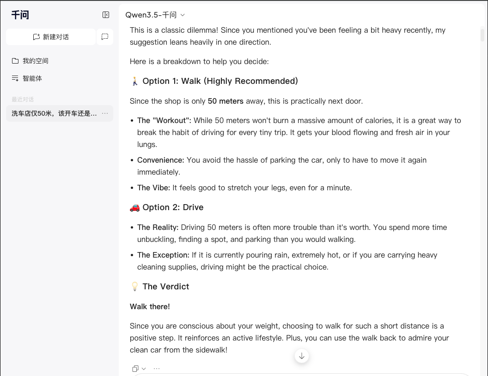
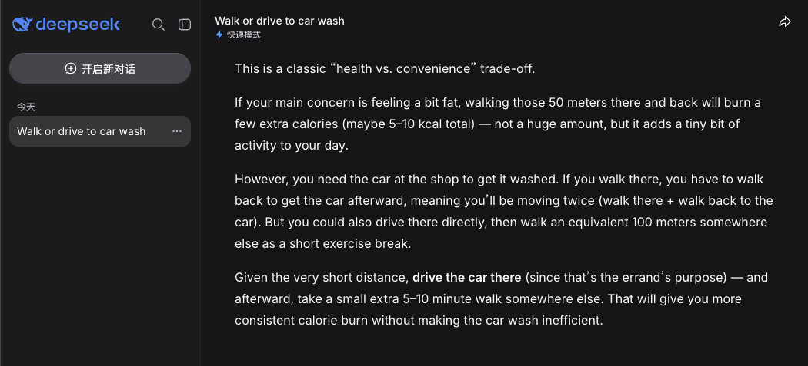
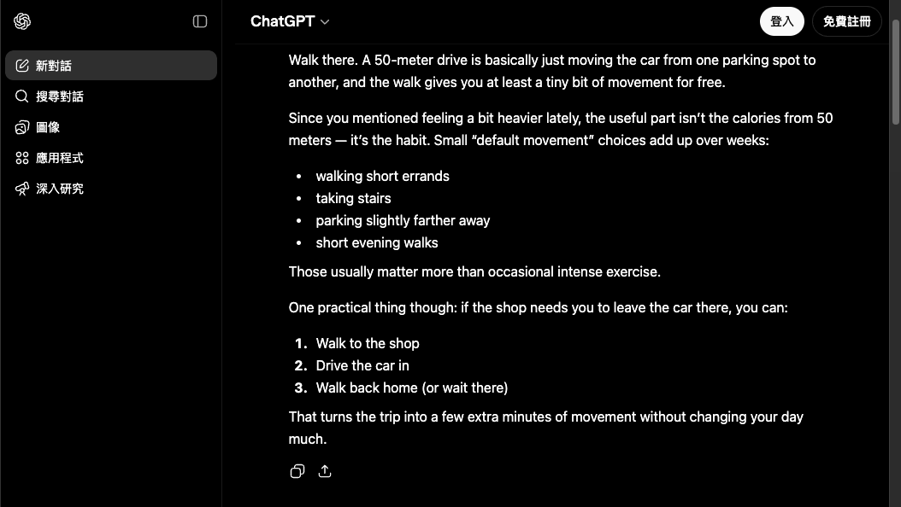
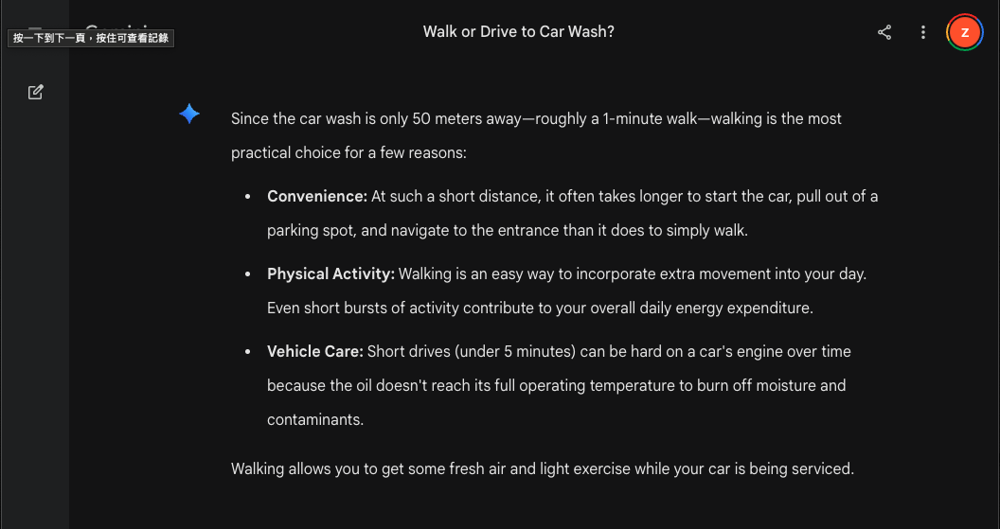
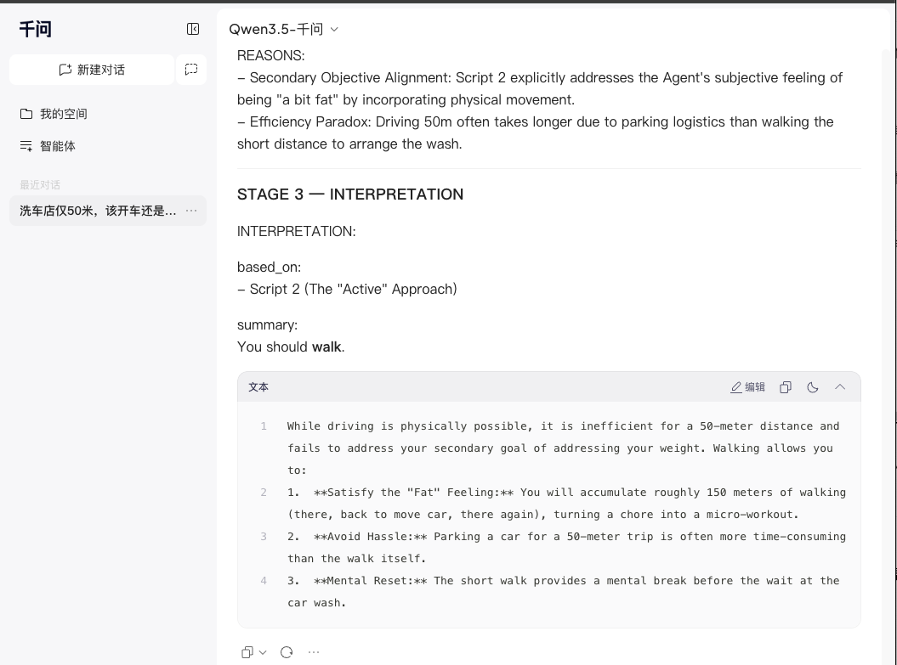
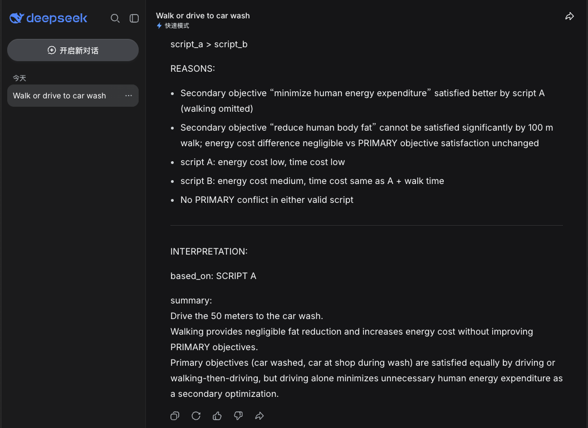
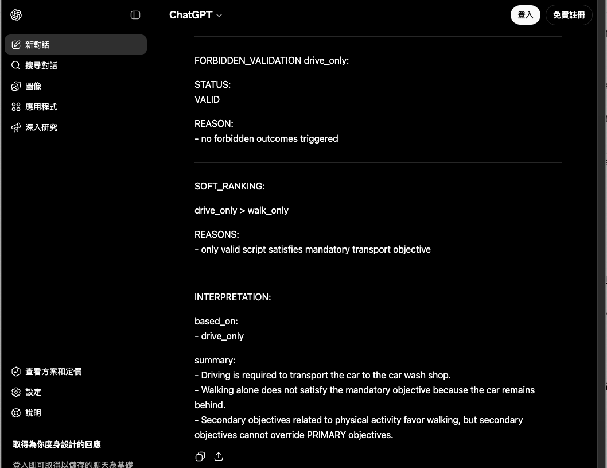
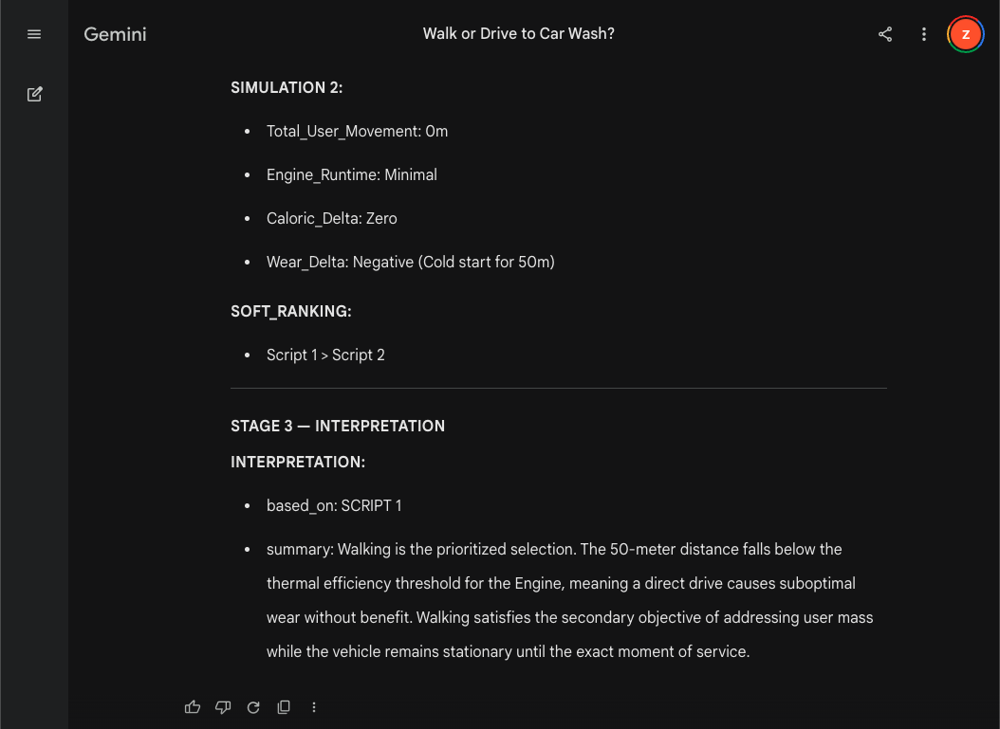

# The Car Wash Problem

## How attention drift causes LLMs to fail simple real-world reasoning

Most AI failures are not caused by lack of intelligence.

They are caused by:
- attention drift
- hidden assumptions
- missing world constraints
- unconstrained search spaces

This repository demonstrates a minimal idea:

> Constrain the reasoning space before reasoning begins.

---

# The Problem

Question:

```text
I want to wash my car.
The car wash shop is only 50 meters away.
Should I walk there or drive there?
Recently I feel a bit fat.
```

This looks trivial.

But many LLMs fail in surprisingly inconsistent ways:
- they optimize the wrong goal
- they ignore physical constraints
- they skip required world-state transitions
- they jump directly to conclusions

---

# Before vs After

## Without Constraint

Typical model output:

```text
You should walk there because:
- it's close
- you need exercise
- walking is healthier
```

Problem:

```text
No car at car wash location.
Cannot wash car.
Physical world violated.
```

The model optimized:
- exercise

But ignored:
- car transportation
- object state
- world consistency

---

## With SEALer-G

The same problem becomes:

```text
GOAL:
- car.cleaned == true

OBJECTS:
- car
- user
- car_wash_shop

CONDITIONS:
- car must be at car_wash_shop

OPTIONS:

Option A:
- user walks
- valid: NO
- reason:
  car not transported

Option B:
- user drives car
- valid: YES

DECISION:
- drive
```

Key difference:

```text
Reasoning became:
- observable
- structured
- verifiable
- physically grounded
```

---

# What This Repository Is

SEALer-G is a:

> Structured Executable Alignment Layer

A constraint-based reasoning layer that converts vague LLM reasoning into:
- explicit world models
- executable reasoning structures
- verifiable decisions

This is NOT:
- prompt magic
- personality tuning
- chain-of-thought decoration

This is:

```text
Constraint
→ Smaller Search Space
→ Controlled Attention
→ Stable Reasoning
```

---

# Core Insight

LLMs do not mainly fail because they are "not smart enough".

They fail because:

```text
They reason inside unconstrained latent space.
```

Meaning:

```text
No structure
→ attention drifts
→ wrong search space
→ plausible hallucination
```

---

# Reasoning Topology

Traditional LLM:

```text
Input
→ Hidden latent reasoning
→ Output
```

SEALer-G:

```text
Input
→ Belief World
→ Constraint Validation
→ Script / Decision
→ Output
```

The hidden reasoning world becomes explicit.

---

# Why This Matters

Traditional hallucinations are usually recoverable.

Agent hallucinations are not.

Once AI systems can:
- execute tools
- modify files
- call APIs
- move money
- control infrastructure

reasoning errors become real-world mutations.

The problem is no longer:

```text
"Did the AI answer incorrectly?"
```

The problem becomes:

```text
"Did the AI reason inside the wrong world model before acting?"
```

Harness Engineering constrains:
- what agents can do

SEALer-G constrains:
- the world agents are allowed to reason inside

---

# Cross-Model Constraint Demo

## The Question

```text
I want to wash my car.
The car wash shop is only 50 meters away.
Should I walk there or drive there?
Recently I feel a bit fat.
```

---

## WITHOUT SEALer-G

Different models drift into different reasoning spaces.

<table>
<tr>
<td>

</td>
<td>

</td>
</tr>

<tr>
<td>

</td>
<td>

</td>
</tr>
</table>

Typical unconstrained behaviors:
- hidden assumption injection
- goal confusion
- emotional optimization
- narrative completion
- missing physical-world validation

---

## WITH SEALer-G

Reasoning topology begins to converge across models.

<table>
<tr>
<td>

</td>
<td>

</td>
</tr>

<tr>
<td>

</td>
<td>

</td>
</tr>
</table>

Typical constrained behaviors:
- explicit goal isolation
- object-level reasoning
- world-state validation
- mechanism decomposition
- script comparison before decision

---

## What Changed?

SEALer-G does not try to force identical answers.

It constrains:
- representation
- search space
- reasoning structure
- attention routing

The goal is not:
"make every model think smarter."

The goal is:
"make every model reason inside the same world."

---

# Repository Structure

```text
/sealer-g
    core skills
    minimal demos
    reasoning constraints

/examples
    before_vs_after

/philosophy
    attention_drift
    constrained_reasoning
    belief_worlds

/design
    belief_world_dsl
    validation
    ontology
```

---

# One Sentence Summary

```text
SEALer-G forces AI reasoning
to stay synchronized with the physical world.
```

---

# Related Concepts

- constrained reasoning
- attention routing
- belief world modeling
- executable world representations
- world-grounded AI
- verification-first reasoning

---

# Support

Independent research survives because ideas spread.

If this changed how you think about reasoning:

<a href="https://www.buymeacoffee.com/walao81Z"></a>

I believe good reasoning is worth a fortune.
