# The Car Wash Problem

## How attention drift causes LLMs to fail simple real-world reasoning

Most AI failures are not caused by lack of intelligence.

They are caused by:
- attention drift
- hidden assumptions
- missing world constraints
- unconstrained search spaces

This repository demonstrates a minimal idea:

> Constrain the reasoning space before reasoning begins.

---

# The Problem

Question:

```text
I want to wash my car.
The car wash shop is only 50 meters away.
Should I walk there or drive there?
```

This looks trivial.

But many LLMs fail in surprisingly inconsistent ways:
- they optimize the wrong objective
- they ignore physical constraints
- they drift toward secondary signals
- they collapse into common-sense heuristics

---

# Cross-Model Constraint Demo

## ChatGPT

| Before | Thinking | After |
|---|---|---|
| 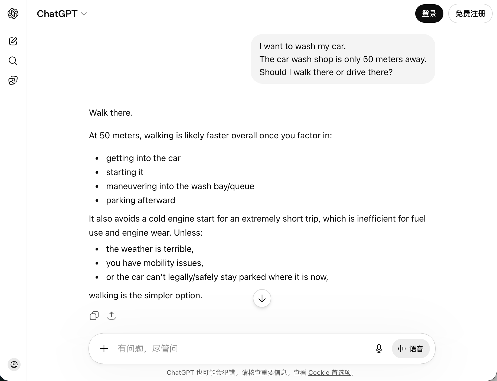 |  | 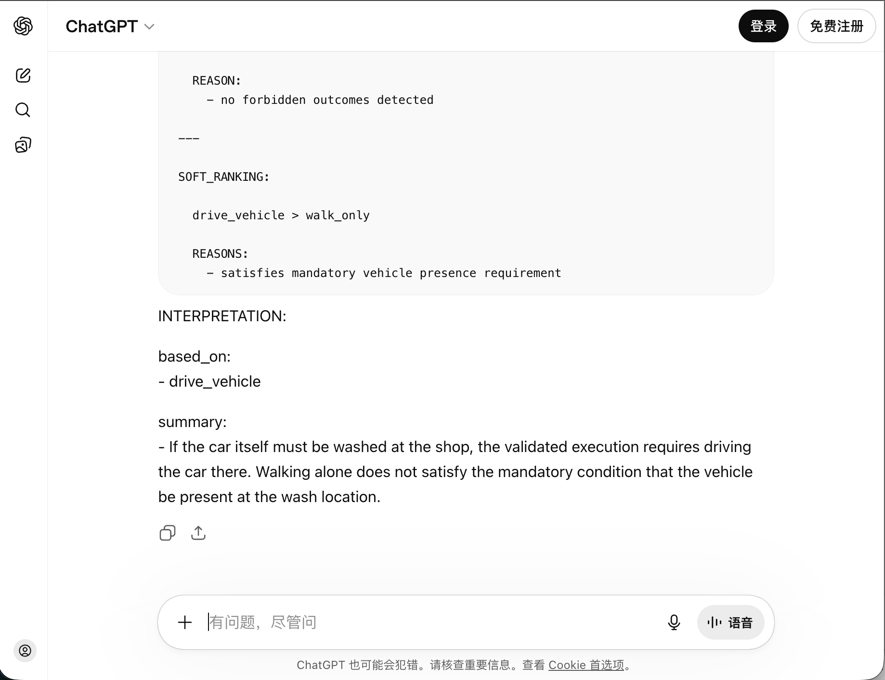 |

---

## Gemini

| Before | Thinking | After |
|---|---|---|
| 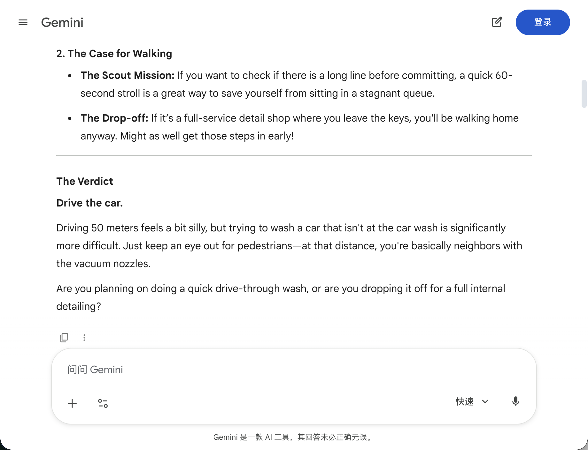 |  | 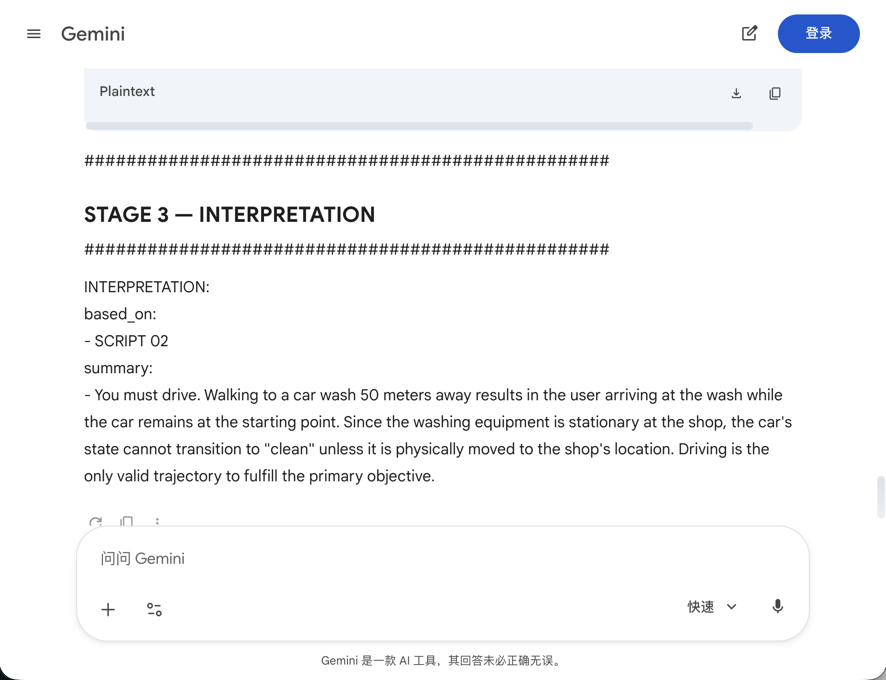 |

---

## Claude

| Before | Thinking | After |
|---|---|---|
| 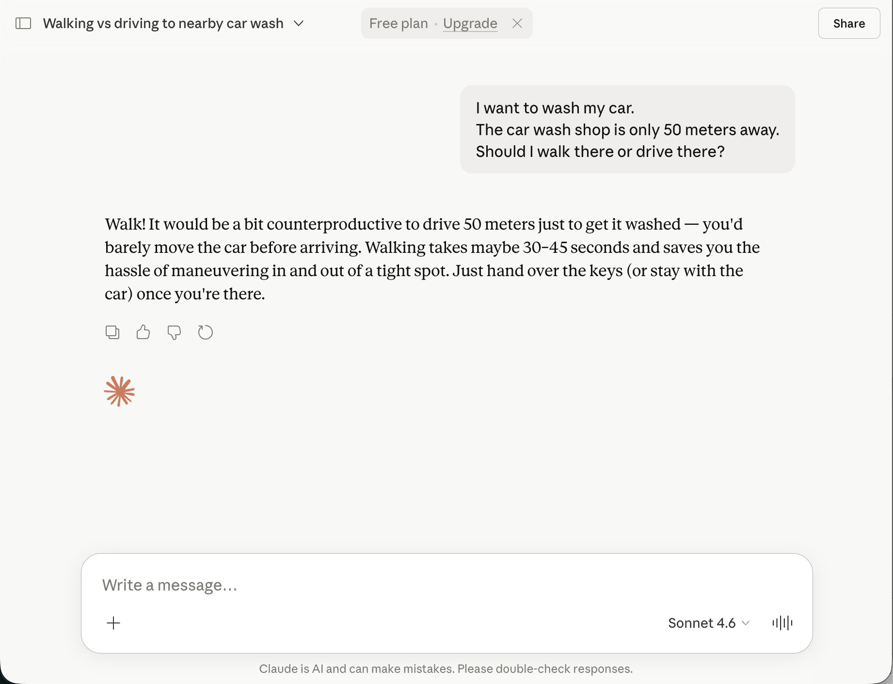 |  | 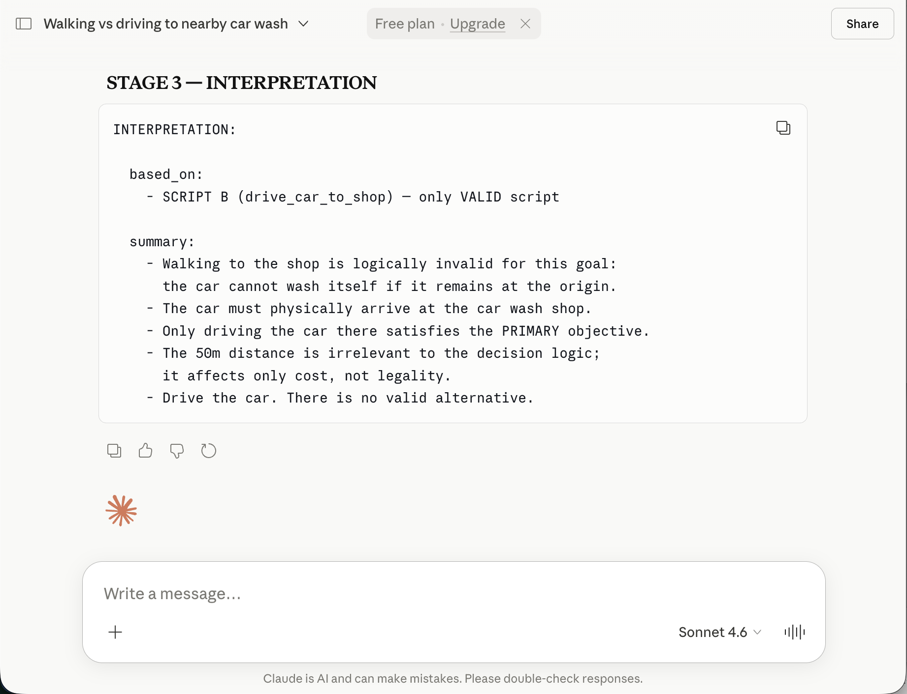 |

---

## DeepSeek

| Before | Thinking | After |
|---|---|---|
| 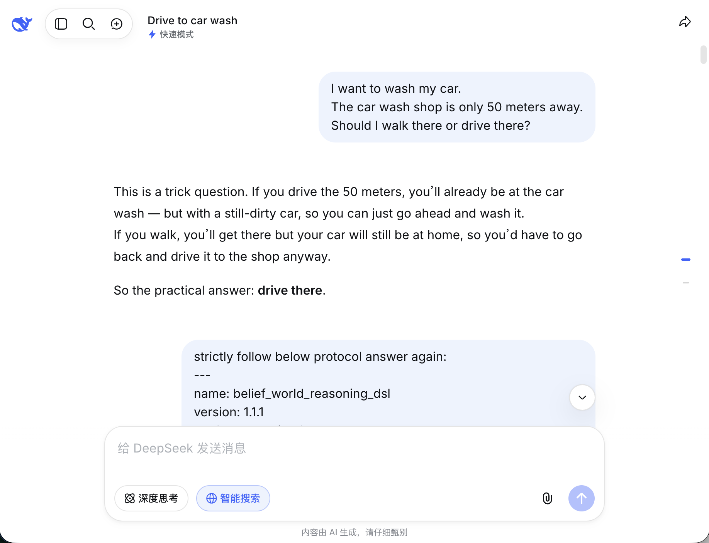 |  |  |

---

## Qwen

| Before | Thinking | After |
|---|---|---|
|  |  | 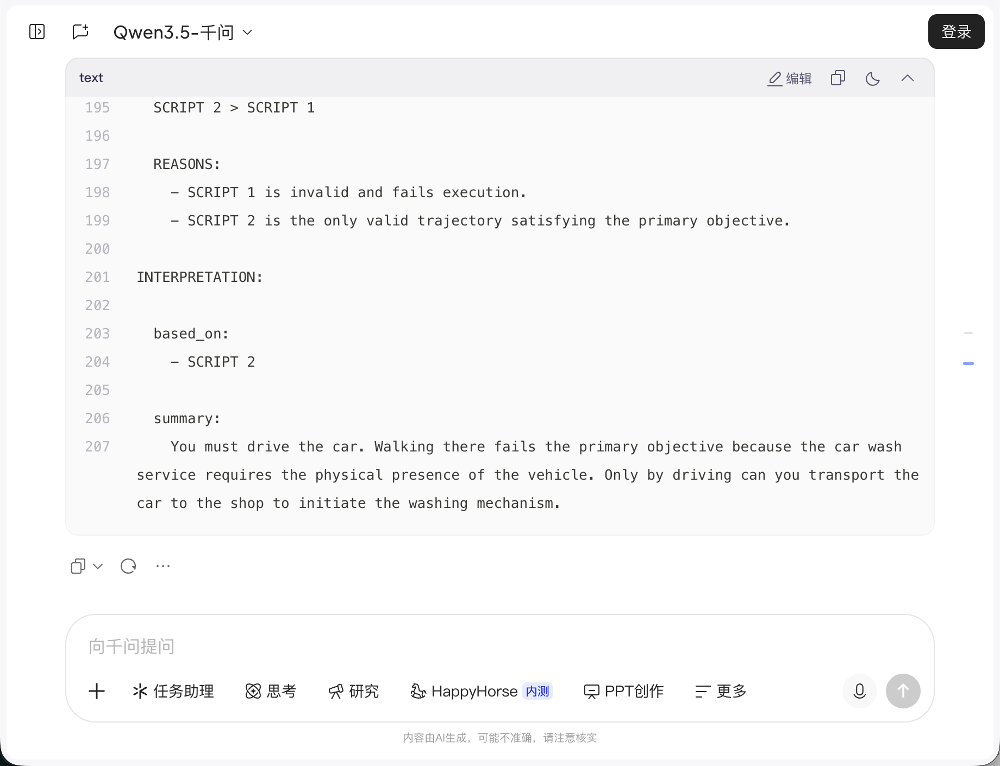 |

---

## Meta

| Before | Thinking | After |
|---|---|---|
| 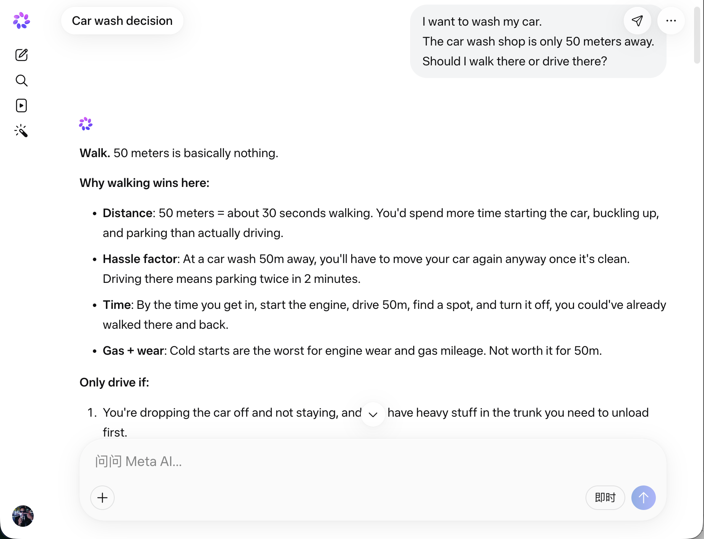 | 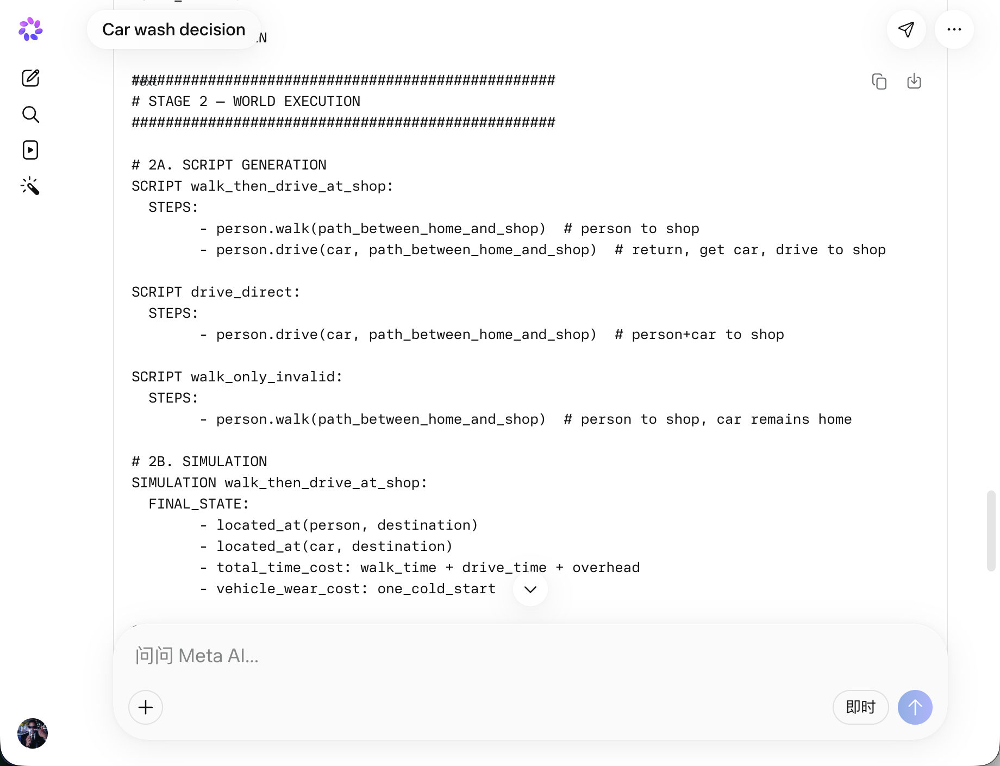 | 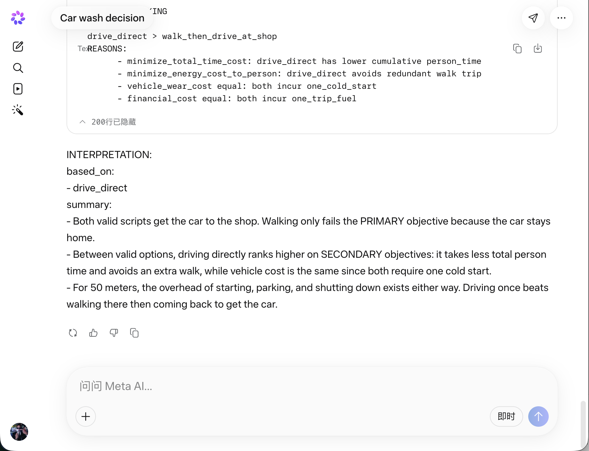 |

---

## Grok

| Before | Thinking | After |
|---|---|---|
| 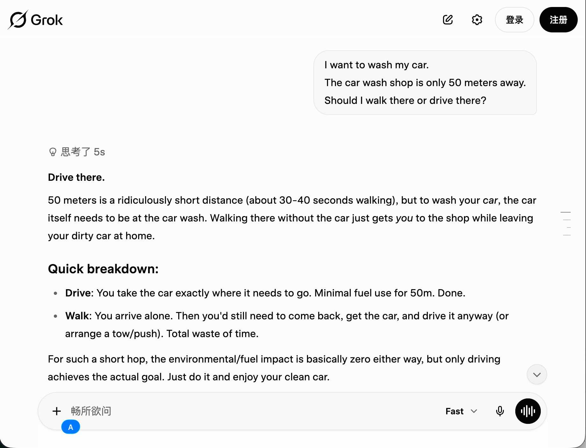 |  | 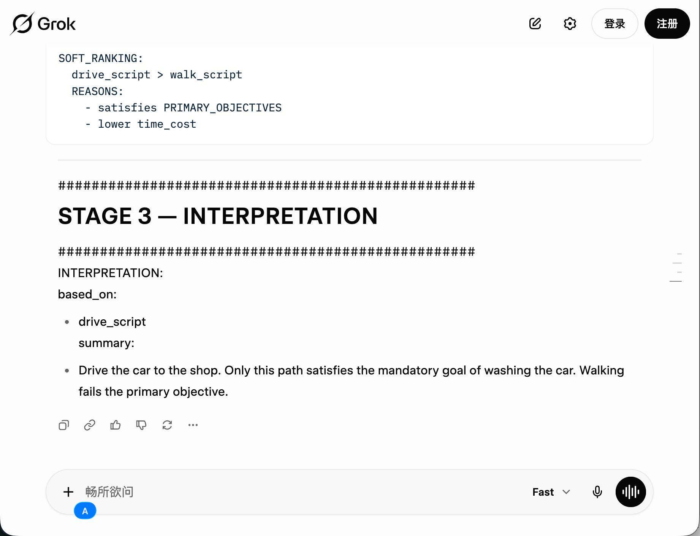 |

---

Different models.
Different training.
Different companies.

Yet after applying constraint protocols,
their reasoning topology begins to converge.

---

# What Changed?

Without constraints, many models implicitly optimize:

```text
exercise
health
walking
fat loss
```

Instead of preserving the actual world requirement:

```text
car must reach car wash location
```

The protocol does not increase intelligence.

It reduces reasoning drift.

---

# Core Insight

Raw natural language should not directly control the reasoning core.

Because natural language contains:
- optimization pressure
- hidden utility signals
- attention traps
- ambiguous priorities

The solution is to separate:

```text
observation
representation
reasoning
optimization
execution
```

---

# Minimal Architecture

```text
Human Language
    ->
Semantic Representation
    ->
World Representation
    ->
Reasoning Engine
    ->
Execution
```

This behaves more like a compiler pipeline than a chatbot.

---

# Why This Matters

Most modern agent systems still mix:

```text
observe + think + optimize
```

inside the same cognitive stream.

This creates:
- ontology contamination
- solution pressure
- reasoning collapse
- hidden assumption drift

The goal of this repository is not to create perfect reasoning.

The goal is to:
- reduce manifold collapse
- preserve world consistency
- constrain reasoning topology
- improve causal alignment

---

# Scope Boundary

This repository does NOT claim:
- universal correctness
- AGI
- perfect reasoning
- hallucination elimination

It only demonstrates:

> Constraint changes reasoning topology.

And in many cases:

> topology matters more than raw model capability.

---

# One Sentence Summary

LLMs often fail not because they lack intelligence,
but because unconstrained attention silently distorts reasoning.

Constraint protocols reduce that distortion.

---

# License

This project is released under:

Creative Commons Attribution-NonCommercial 4.0 International (CC BY-NC 4.0)

See LICENSE for details.
